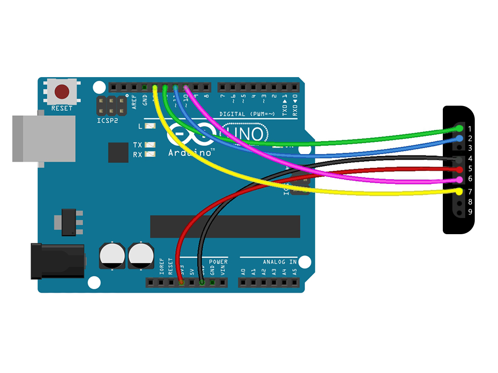

# ds2linux-arduino
Dualshock 2 support for linux with an arduino.
## How It Works
Simply the driver reads the joystick state on arduino via serial connection, and the apps receive the state through a virtual joystick.
## Scheme


## Compiling & Usage
1. Compile and upload the Arduino project with Arduino IDE
2. Compile and run the driver
```
$ make
$ sudo ./ds2linux -h
Options:
        -h      Display help
        -a      Disable analog input
        -d      Disable digital input

```
## Keybindings
Here is the PCSX2 keybinding configuration for both analog and digital inputs enabled, put into .ini file;
```
[Pad1]
Type = DualShock2
InvertL = 0
InvertR = 0
Deadzone = 0
AxisScale = 1
LargeMotorScale = 1
SmallMotorScale = 1
ButtonDeadzone = 0
PressureModifier = 0.5
LUp = SDL-0/-LeftY
LDown = SDL-0/+LeftY
LLeft = SDL-0/-LeftX
LRight = SDL-0/+LeftX
RUp = SDL-0/-RightY
RDown = SDL-0/+RightY
RLeft = SDL-0/-RightX
RRight = SDL-0/+RightX
Triangle = SDL-0/Y & SDL-0/+Axis10
Cross = SDL-0/A & SDL-0/+Axis11
Square = SDL-0/X & SDL-0/+Axis13
Circle = SDL-0/B & SDL-0/+Axis12
L3 = SDL-0/LeftStick
R3 = SDL-0/RightStick
LargeMotor = SDL-0/LargeMotor
SmallMotor = SDL-0/SmallMotor
Up = SDL-0/DPadUp & SDL-0/+Axis14
Right = SDL-0/DPadRight & SDL-0/+Axis17
Down = SDL-0/DPadDown & SDL-0/+Axis15
Left = SDL-0/DPadLeft & SDL-0/+Axis16
Select = SDL-0/Back
Start = SDL-0/Start
Analog = SDL-0/Guide
R2 = SDL-0/+Axis20 & SDL-0/+RightTrigger
R1 = SDL-0/RightShoulder & SDL-0/+Axis18
L2 = SDL-0/+Axis21 & SDL-0/+LeftTrigger
L1 = SDL-0/LeftShoulder & SDL-0/+Axis19
```
